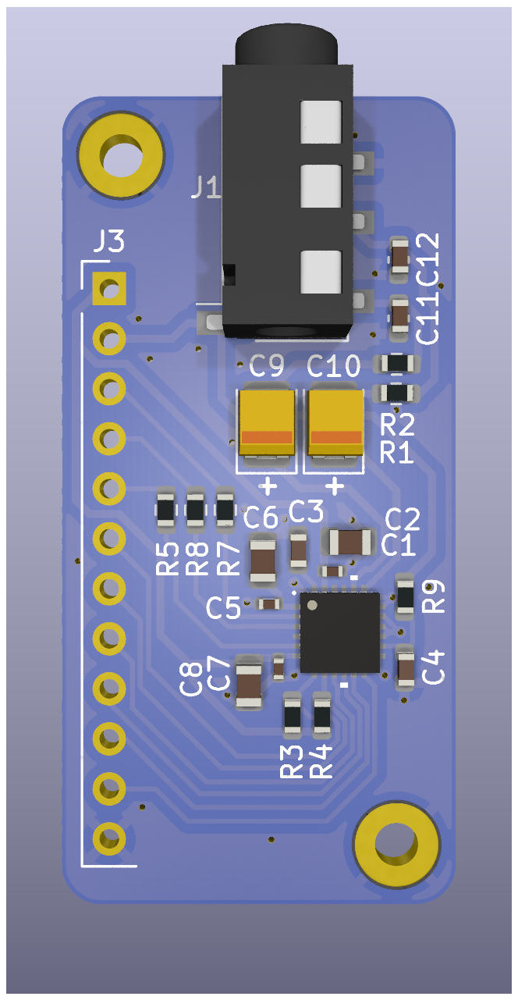
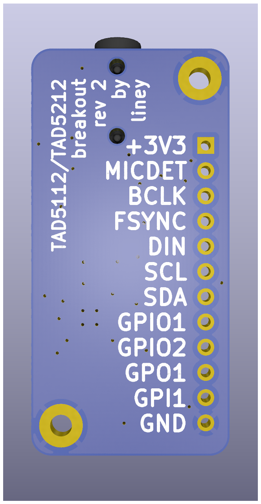

# tad5212_breakout

A breakout board for TI's [TAD5212](https://www.ti.com/product/TAD5212) and [TAD5112](https://www.ti.com/product/TAD5112) DACs (they are drop-in replacements of each other).

Should work as both 2-layer and 4-layer boards. All signals are on layer 1.

If ordering the board with assembly, make sure the orientation of the tantalum caps is correct.

No guarantees on the level of noise, I am inexperienced in PCB design. Raise an issue if you have advice or ideas.

⚠️ I couldn't yet test if headset detection is working or not.

|  |  |
| ------------------- | --------------------- |

## Usage

I test this board with [PocketBeagle 2](https://docs.beagle.cc/boards/pocketbeagle-2/), kernel 6.18.10, driver snd-soc-pcm6240, and **[this dtso](tad5x12.dtso)**.

Hookup:

| PocketBeagle 2 | Breakout |
| -------------- | -------- |
| P1.26          | SDA      |
| P1.28          | SCL      |
| P2.01          | BCLK     |
| P1.02          | DIN      |
| P1.04          | FSYNC    |
| P1.14          | +3V3     |
| P1.22          | GND      |

My configuration registers ([see binary](tad5212-i2c-2-1dev.bin)):

```
02 01  // DEV_MISC_CFG -- not in sleep
19 40  // 2 data outputs for Primary ASI, no data outputs for Secondary ASI
1a 70  // I2S mode, 32 bits, BCLK and FSYNC polarity standard
64 24  // Stereo single-ended (DAC1A / IN1M -> OUT1P ; DAC1B / IN1P -> OUT1M)
65 60  // OUT1P: headphone driver, 0dB
66 60  // OUT1M: headphone driver, 0dB
67 c9  // Channel 1A: Digital Volume Control set to 0 dB
69 c9  // Channel 1B: Digital Volume Control set to 0 dB
29 30  // TDM is slot 16 or I2S, LJ is right slot 0
76 0c  // CH_EN
78 40  // PWR_CFG
```

## Firmware editing

I do not use the TI tools for firmware editing, I write it by hand.

If using ImHex, this pattern could be convenient to use:

```
#pragma endian big
import std.io;

enum blk_type: u8 {
    PCMDEVICE_BIN_BLK_COEFF = 1,
    PCMDEVICE_BIN_BLK_POST_POWER_UP = 2,
    PCMDEVICE_BIN_BLK_PRE_SHUTDOWN = 3,
    PCMDEVICE_BIN_BLK_PRE_POWER_UP = 4,
    PCMDEVICE_BIN_BLK_POST_SHUTDOWN = 5
};

enum subblk_type: u16 {
    PCMDEVICE_CMD_SING_W = 0x1,
    PCMDEVICE_CMD_BURST = 0x2,
    PCMDEVICE_CMD_DELAY = 0x3,
    PCMDEVICE_CMD_FIELD_W = 0x4,
};

fn format_hex(auto value) {
    return std::format("0x{:02X}", value);
};

struct reg_write_cmd {
    u16 dev_no [[color("888888")]];
    u8 reg [[format("format_hex"), color("FF0000")]];
    u8 value [[format("format_hex"), color("00FF00")]];
};

struct subblk {
    subblk_type subblk_type;
    u16 subblk_len;
    reg_write_cmd cmds[subblk_len];
};

struct data_block {
    u8 dev_idx;
    blk_type block_type;
    u16 yram_checksum;
    u32 block_size;
    u32 n_subblks;
    subblk subblk[n_subblks];
};

u32 file_size @ 0x00;
u32 checksum @ 0x04;
u32 binary_version @ 0x08;
u32 drv_fw_version @ 0x0C;
u8 plat_type @ 0x14;
u8 dev_family @ 0x15;
u8 reserve @ 0x16;

u8 ndev @ 0x17;
u8 devs[0x08] @ 0x18;
u32 nconfig @ 0x20;
u32 config_size[0x40] @ 0x24;

char config_name[0x40] @ 0x124;
u32 nblocks @ 0x164;

data_block data_block[nblocks] @ 0x168;
```
